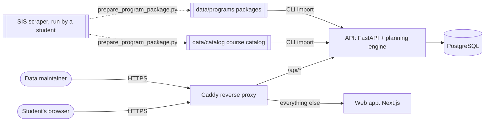
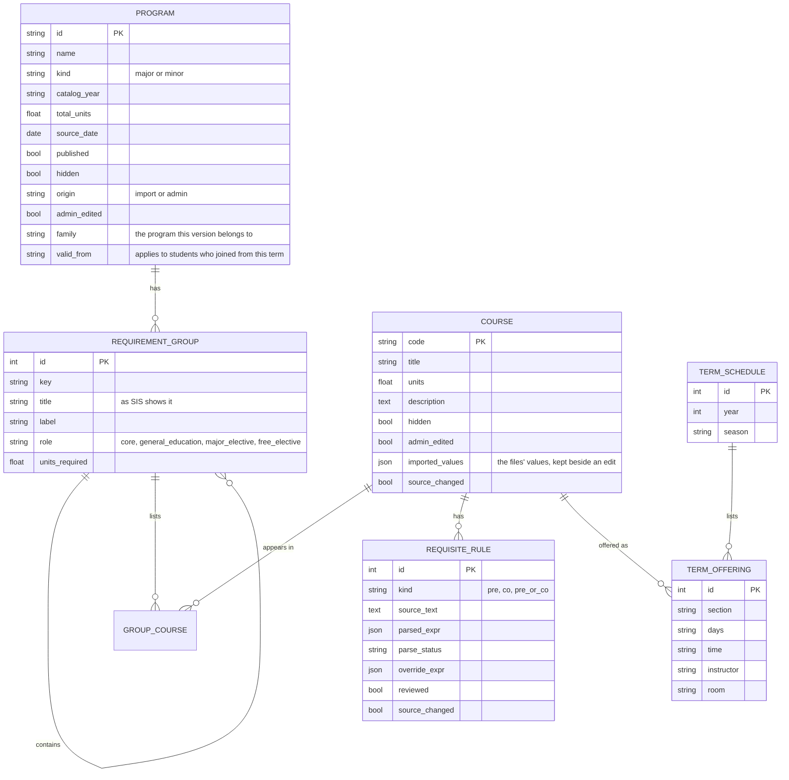

# Architecture

The system is three services behind one reverse proxy. All planning logic lives in one API, so the
curriculum model is built once and every feature reads from it. For a diagram of each part, with what
to check in an audit, see [system-diagrams.md](system-diagrams.md).



- **Caddy** is the only container with published ports. It terminates TLS (with automatic
  certificates when given a domain name) and routes `/api/*` to the API and everything else to the web
  app, so the browser talks to a single origin and no cross-origin requests are needed.
- **Web app** (Next.js) serves pages that are prerendered at build time. Student data never touches
  the web server: the browser keeps the profile in local storage and calls the API directly.
- **API** (FastAPI) is stateless for students: each planning request carries the student's courses,
  the API computes the answer and keeps nothing. It stores only catalog data, admin corrections,
  import history and the audit log.
- **PostgreSQL** sits on an internal Docker network with no route in or out.

## Inside the API

```
api/app/
  domain/        pure planning logic: no database, web framework or I/O
    codes, terms             course codes and academic terms ("2024/2025 Fall")
    requisites               rule tree, description parser, rule language, evaluation
    catalog                  in-memory courses, rules and requirement trees
    record, history          student attempts; the Course History paste parser
    progress                 which course counts toward which requirement
    graph                    prerequisite graph, gateway courses, chains
    planner, whatif          term-by-term plans with replacement options; drop/delay simulation
    journey                  the degree map: courses by term with prerequisite links
    gpa                      cumulative and term GPA, retake suggestions
    recommend                interest- and goal-based elective ranking
  importer/      course catalog and program packages: load, validate, write to the database;
                 tables (CSV, spreadsheet pastes and .xlsx uploads)
  services/      catalog cache (database -> in-memory catalog); catalog_edit (admin changes to courses,
                 programs and term schedules); backup (encrypted export and restore)
  api/           routes, request/response schemas, conversions
  models.py      database tables;  migrations/ holds the Alembic history
  security.py    headers, body-size limit, rate limit, request logging
  cli.py         validate / import the catalog and packages, export the OpenAPI schema,
                 encrypted backups (export, inspect, restore)
```

The `domain` package has no dependencies on the web or database layers, so every rule can be tested
with plain data. 168 of the API's 247 tests exercise it directly against the real course catalog and programs.

### A planning request

1. The browser posts the student's program, course attempts and preferences to `/api/v1/planner/plan`.
2. The API reads the catalog from its in-memory cache. Each request checks one integer, the catalog
   revision, and reloads the cache if an import or admin correction changed it.
3. The planner selects the courses still needed (complete course lists, the prerequisites they
   require, electives that fit the student's interests without lengthening the longest chain, and
   open-choice "slots"), then schedules them term by term. See
   [ADR 0003](decisions/0003-heuristic-planner.md).
4. The response includes the plan, progress per requirement group, what is left, courses eligible next
   term, the degree map, GPA, warnings, the assumptions used and the catalog's source date. A full degree
   takes about 20 ms.

### Importing a program

`python -m app.cli import <package>` first imports the shared course catalog: it validates it, upserts
courses and re-parses every requisite rule from its description while keeping admin corrections. It then
validates the package against the courses in the database (errors block, warnings are reported),
replaces the program's requirement tree, bumps the catalog revision and records an import run and an
audit entry for each. Importing the same files twice changes nothing. See [data-pipeline.md](data-pipeline.md).

A student may add a minor. The planner chooses the minor's courses before the major's open choices, and
a course counts toward both wherever it can, as AUIB allows.

A program can have several versions (F0.4): rows that share a `family` and each apply to students who
joined from their `valid_from` term. Each request picks the version with `choose_version`
(`app/domain/catalog.py`): the newest version that applied when the student joined, taking the term
from the student's answer, else the first term in their Course History, else next term. The plan
response says which version applies and why.

### Changes from the admin page

Admins can edit, add and hide courses, build or edit majors and minors, publish term schedules, and
back up or restore the data (`app/api/routes/admin_catalog.py`, `app/services/catalog_edit.py`,
`app/services/backup.py`). Each change is audited and raises
the catalog revision like an import does. Whether a course can be planned in a term is decided in one
place, `Catalog.offered`: the course must exist, not be hidden, run in that season, and, when the term
has a published schedule, be on it. Imports never overwrite admin work (see
[data-pipeline.md](data-pipeline.md#6-changes-in-the-admin-page)).

## Data model



Credits are stored in fields named `units` (as the SIS export names them); the app shows them as
credits.

Supporting tables: `import_runs` (every import with its validation report), `audit_log` (every admin
action) and `catalog_state` (the catalog revision). Student and plan tables arrive with AUIB sign-in;
guests are never stored.

## Technology choices

| Layer | Choice | Why |
| --- | --- | --- |
| Web app | Next.js 16 (React 19, TypeScript, Tailwind CSS) | One codebase for phones and laptops; static pages; typed against the API schema |
| API | Python 3.13, FastAPI, Pydantic | Same language as the scraper; strict input validation; OpenAPI schema for free |
| Planning | Own heuristic scheduler on NetworkX graphs | Deterministic, explainable, about 30 ms per plan ([ADR 0003](decisions/0003-heuristic-planner.md)) |
| Database | PostgreSQL 17 via SQLAlchemy 2 and Alembic | Relational catalog with JSON rule columns; versioned migrations |
| Proxy | Caddy 2 | Automatic HTTPS, one public entry point |
| Packaging | Docker Compose | The same images run on a laptop, a cloud VM or AUIB IT servers ([ADR 0001](decisions/0001-stack-and-deployment.md)) |
