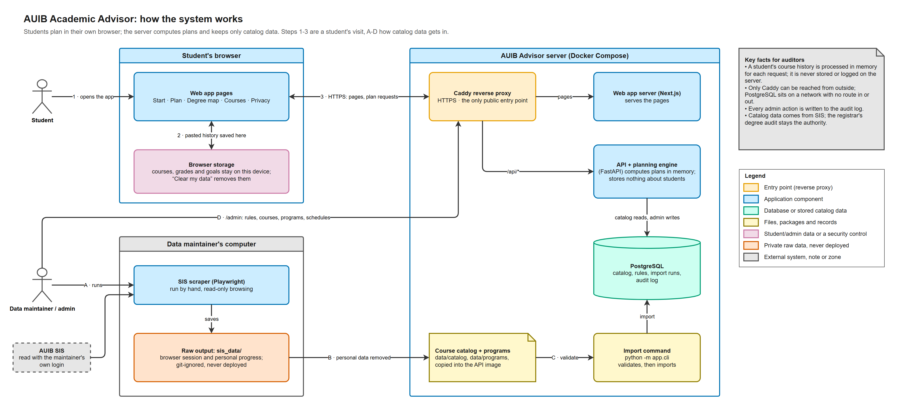
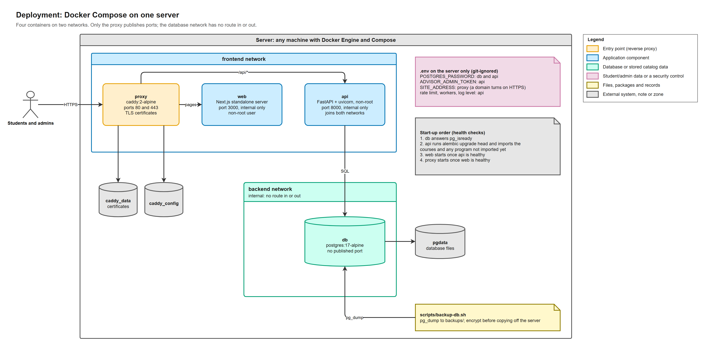
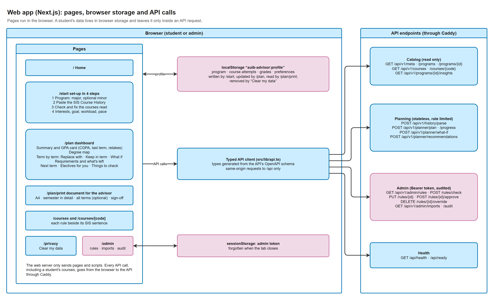
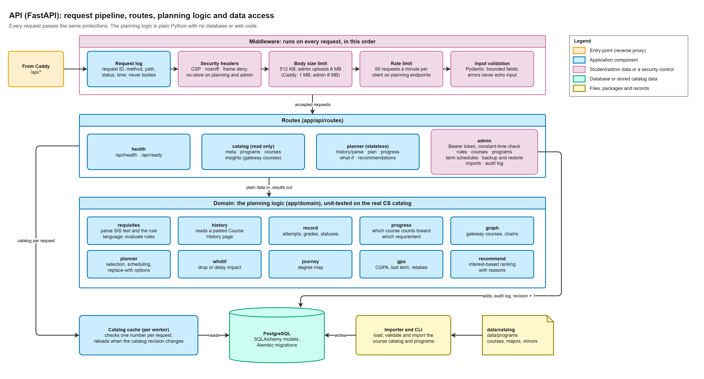
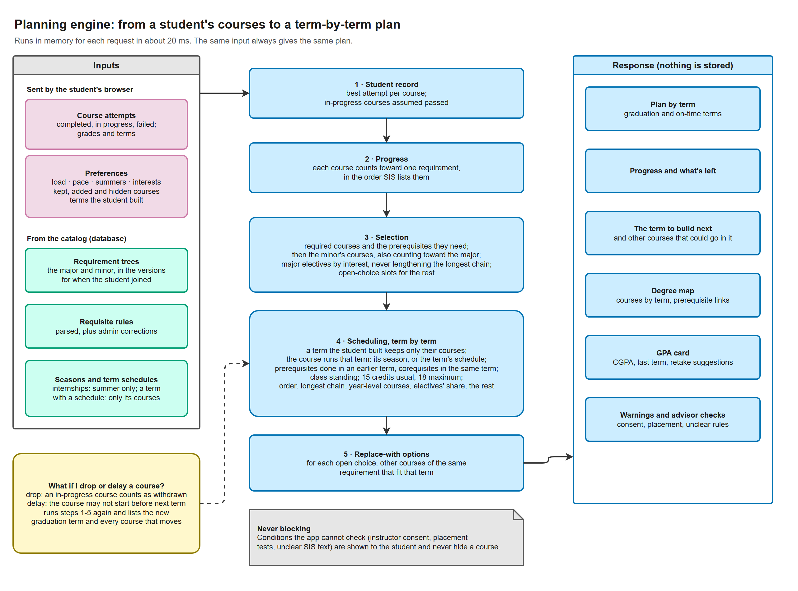
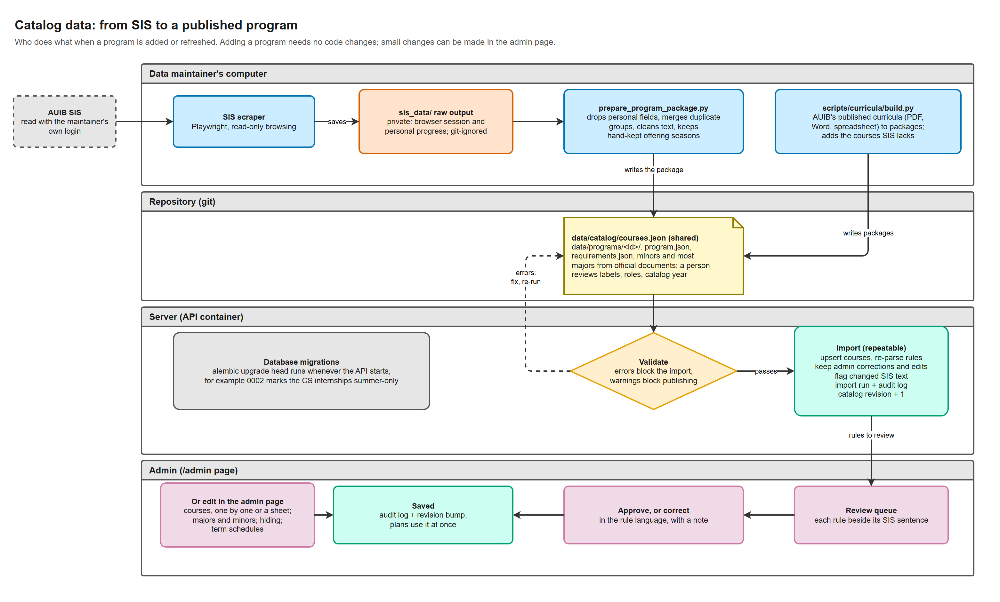
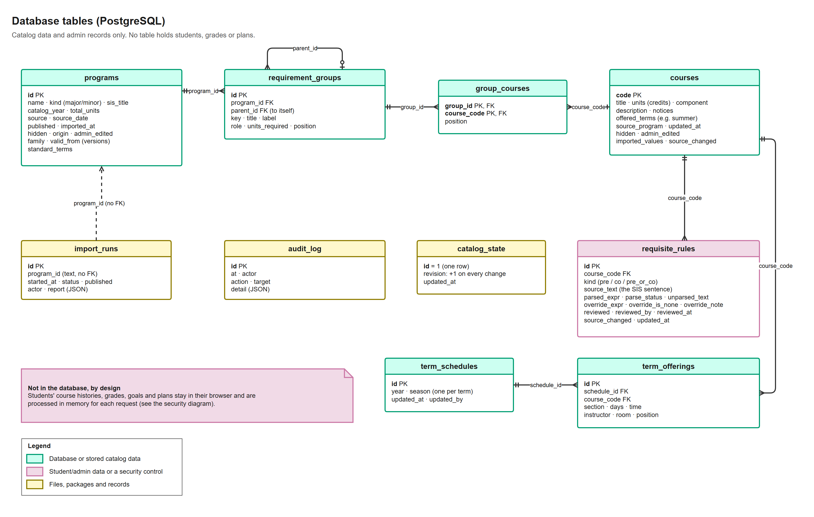
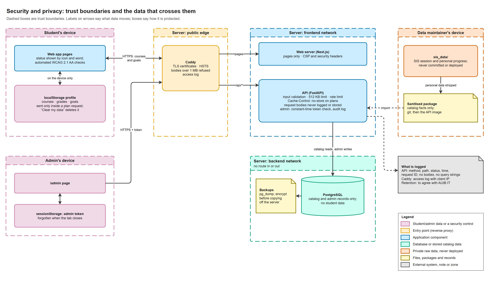
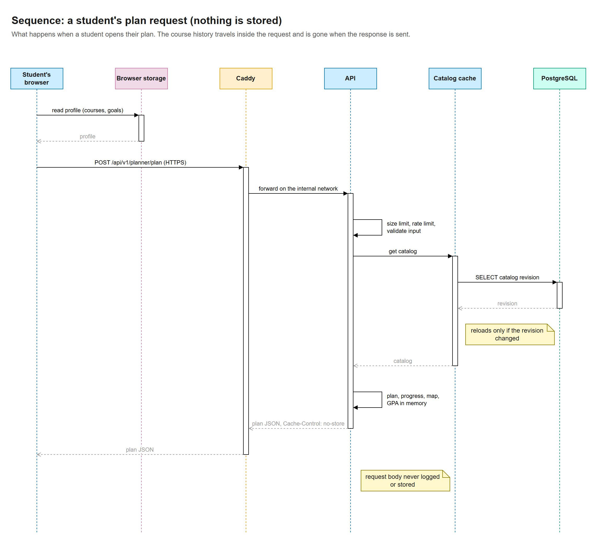
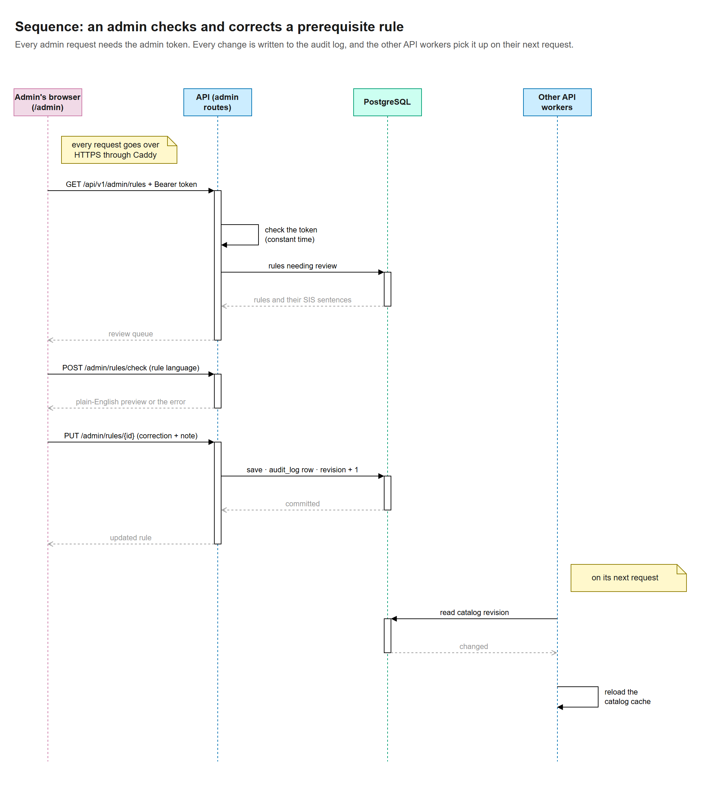

# System diagrams

These diagrams explain how the AUIB Academic Advisor works, for the people who review and run it:
the CS department, AUIB IT and anyone auditing the system. Start with the overview, then open the
diagram for the part you are checking. Each section ends with **What to check**, which lists the files
and tests that prove what the diagram shows.

All diagrams use the same colours, chosen so they can be told apart with colour blindness:

| Colour | Meaning |
| --- | --- |
| Orange | Entry point (the Caddy reverse proxy) |
| Blue | Application component |
| Green | Database, or catalog data stored in it |
| Yellow | Files, program packages and records |
| Pink | Student or admin data, or a security control |
| Red-orange | Private raw data that is never deployed |
| Grey | External system, note or zone |

Dashed boxes are trust boundaries. Arrows show the direction data moves; a label on an arrow says what
moves.

| # | Diagram | Answers |
| --- | --- | --- |
| 0 | [Overview](#0-overview) | What are the parts and how do they connect? |
| 1 | [Deployment](#1-deployment) | What runs on the server, and what is reachable? |
| 2 | [Web app](#2-web-app) | Where does a student's data live in the browser? |
| 3 | [API](#3-api) | What protections does every request pass? |
| 4 | [Planning engine](#4-planning-engine) | How is a plan worked out? |
| 5 | [Catalog data](#5-catalog-data) | How does SIS data become a published program? |
| 6 | [Database tables](#6-database-tables) | What is stored? |
| 7 | [Security and privacy](#7-security-and-privacy) | Which data crosses which boundary? |
| 8 | [A student's plan request](#8-a-students-plan-request) | What happens, step by step, when a plan is made? |
| 9 | [An admin corrects a rule](#9-an-admin-corrects-a-rule) | How are admin changes checked and recorded? |

## 0. Overview

A student uses the app in their own browser (steps 1 to 3). Their pasted Course History, grades and
goals are saved in that browser only and sent to the server with each request. The server works out
the plan in memory and keeps nothing about the student.

Catalog data gets in through steps A to D. The data maintainer scrapes programs and courses from SIS
on their own computer. A script removes the personal data. Courses go into one AUIB-wide course
catalog shared by every program, and each major or minor becomes a program package (its requirements
only). The catalog and packages are validated, then imported into the database. An admin then
reviews the prerequisite rules in the `/admin` page.

**What to check**

- Only the proxy publishes ports: `ports:` appears only under `proxy` in
  [docker-compose.yml](../docker-compose.yml).
- No student data is stored: [api/app/models.py](../api/app/models.py) has no table for students,
  grades or plans; [ADR 0002](decisions/0002-stateless-guest-mode.md) explains the decision.
- The raw scrape stays private: `sis_data/` is in [.gitignore](../.gitignore), and the API image copies
  only the files allowed by [api/Dockerfile.dockerignore](../api/Dockerfile.dockerignore).

## 1. Deployment

Four containers run on one server with Docker Compose. The proxy is the only container with published
ports (80 and 443). The database sits on a separate internal network that has no route in or out; only
the API joins both networks. Data lives in three named volumes, and secrets come from a `.env` file
that exists only on the server. Moving to another server needs this repository, the `.env` file and a
database backup.

**What to check**

- `internal: true` on the `backend` network, and no `ports:` on `db`, `api` or `web`:
  [docker-compose.yml](../docker-compose.yml).
- Containers run as a non-root user: `USER app` in [api/Dockerfile](../api/Dockerfile) and
  [web/Dockerfile](../web/Dockerfile).
- Start-up order and health checks: `depends_on` with `condition: service_healthy` in
  [docker-compose.yml](../docker-compose.yml); migrations and the first import in
  [api/docker-entrypoint.sh](../api/docker-entrypoint.sh).
- Settings and secrets: [.env.example](../.env.example) lists every setting; `.env` is git-ignored.
- Backups and restores: [scripts/backup-db.sh](../scripts/backup-db.sh),
  [scripts/restore-db.sh](../scripts/restore-db.sh) and [operations.md](operations.md).

## 2. Web app

The web app is a set of pages that run in the browser. A student's profile (program, course attempts,
grades and preferences) is kept in the browser's local storage under `auib-advisor:profile`. "Clear my
data" removes it. Every page calls the API through one typed client, and only to the same site
(`/api`), so the web server never receives a student's courses. The admin token is kept in session
storage and is forgotten when the tab closes. "Print for my advisor" opens `/plan/print`, a document laid
out for paper that prints without the site's menus.

**What to check**

- Storage key and clearing: [web/src/lib/profile.ts](../web/src/lib/profile.ts).
- One API client whose types are generated from the API schema:
  [web/src/lib/api.ts](../web/src/lib/api.ts) and [web/src/lib/api-types.ts](../web/src/lib/api-types.ts).
- Admin token in session storage:
  [web/src/components/admin/AdminConsole.tsx](../web/src/components/admin/AdminConsole.tsx).
- Browser security headers, including a Content Security Policy that only allows the same site:
  [web/next.config.ts](../web/next.config.ts).
- The end-to-end test clears the data and checks that no plan is left:
  [web/e2e/student-flow.spec.ts](../web/e2e/student-flow.spec.ts).
- The advisor document says it schedules nothing and that an advisor's approval is not a promise of
  courses: `NOTICE_TEXT` in [web/src/lib/advisor.ts](../web/src/lib/advisor.ts), checked by
  [advisor.test.ts](../web/src/lib/advisor.test.ts) and the end-to-end test.

## 3. API

Every request passes the same five protections before it reaches a route:

1. The request is logged without its body or query string.
2. Security headers are added, plus `Cache-Control: no-store` on planning and admin responses.
3. Bodies over 512 KB are refused; Caddy also refuses bodies over 1 MB. Admin uploads (a course list
   or a term schedule) may be up to 8 MB, and still need the admin token.
4. Planning endpoints are rate-limited per client.
5. The input is validated against bounded fields, and error messages never repeat it.

The planning logic in `app/domain` is plain Python with no database or web code, so it is tested
directly. Each API worker keeps the catalog in memory. It reloads the catalog when the catalog
revision number in the database changes.

**What to check**

- Middleware order: [api/app/main.py](../api/app/main.py). The middleware is in
  [api/app/security.py](../api/app/security.py).
- Admin token compared in constant time (`hmac.compare_digest`): [api/app/api/deps.py](../api/app/api/deps.py).
- Bounded input that rejects unknown fields (`extra="forbid"`): [api/app/api/schemas.py](../api/app/api/schemas.py).
- Tests in [api/tests/api/test_planner_api.py](../api/tests/api/test_planner_api.py):
  - `test_private_responses_are_not_cached_and_carry_security_headers`
  - `test_logs_hold_no_course_history`
  - `test_large_bodies_are_rejected`
  - `test_rate_limit`
  - `test_bad_input_is_rejected_without_echoing_it`
  - `test_admin_uploads_may_be_larger_than_planning_requests` (in `test_admin_catalog_api.py`)
- Catalog cache: [api/app/services/catalog_cache.py](../api/app/services/catalog_cache.py).
- Admin routes for courses, programs, term schedules, backups and restores:
  [api/app/api/routes/admin_catalog.py](../api/app/api/routes/admin_catalog.py).

## 4. Planning engine

The engine turns a student's course attempts and preferences into a term-by-term plan in about
20 ms. It works in five steps:

1. Build the student record, and choose the version of the major (and minor) that applied when the
   student joined AUIB.
2. Work out progress per requirement.
3. Choose the courses still needed. A minor's courses are chosen first, so they can fill the major's
   free-elective and general-education choices; one course can count toward both.
4. Schedule them term by term.
5. For each open choice, list the courses that could replace it.

A course is only placed in a term it runs in: its season (CS internships run in summer only), or,
when the registrar's schedule for that term is published, only if it is on that schedule. A course an
admin has hidden is never placed. Its prerequisites must be done in an earlier term, and its corequisites taken in the same term. The same input always
gives the same plan. Conditions the app cannot check, such as instructor consent or placement tests,
are shown to the student and never hide a course. [ADR 0003](decisions/0003-heuristic-planner.md)
explains why a rule-based planner was chosen over a solver.

Students build their plan one term at a time (F1.9). A term they have finished keeps exactly the
courses they chose, and the planner fills only the terms after it. The response also names the term
they are building next and the other courses that could go in it, counting the courses in earlier
terms as done.

**What to check**

- The code: [api/app/domain/planner.py](../api/app/domain/planner.py), with
  [progress.py](../api/app/domain/progress.py), [requisites.py](../api/app/domain/requisites.py),
  [whatif.py](../api/app/domain/whatif.py), [journey.py](../api/app/domain/journey.py) and
  [gpa.py](../api/app/domain/gpa.py).
- Tests that run against the real CS catalog, in [api/tests/domain/](../api/tests/domain/):
  - `test_plans_respect_prerequisites_loads_and_requirements`
  - `test_plans_are_deterministic`
  - `test_internships_are_planned_in_summer`
  - `test_replacement_options_follow_the_rules`
  - `test_a_built_term_holds_only_the_students_courses` and
    `test_choices_for_the_term_being_built_count_the_terms_before_it`
  - the minor tests in `test_minor.py`
- Every plan shows the assumptions it was made under: `ASSUMPTIONS` in
  [api/app/api/convert.py](../api/app/api/convert.py).

## 5. Catalog data

The diagram shows who does what when a program is added or refreshed. No code changes are needed.

1. The data maintainer scrapes the program from SIS, read-only, on their own computer.
2. `prepare_program_package.py` drops the personal fields. It adds the program's courses to the shared
   catalog (`data/catalog/courses.json`) and writes the program package (`program.json` and
   `requirements.json`). Both are committed. Programs AUIB publishes as curricula (PDF, Word or
   spreadsheet) go through `scripts/curricula/build.py` instead, which also adds the courses they
   need that SIS does not list.
3. On the server, the catalog and the package are validated. Errors block the import, and warnings
   block publishing. On start, the API container imports the catalog and any package not imported
   yet.
4. The import can be repeated safely. It keeps admin corrections and flags rules whose SIS text has
   changed.
5. Each import is recorded, and the catalog revision goes up, so every API worker reloads.
6. New and changed rules wait in the admin review queue.

Small changes can also be made in the admin page, without a new package: editing, adding (one by one or
from a sheet) and hiding courses, building or editing majors and minors, and publishing term schedules.
They are saved the same way, and a later import keeps them: an edited course keeps its edit and is
flagged when the files change, and a program edited there is only replaced with `--replace-admin-edits`.

**What to check**

- The step-by-step procedure: [data-pipeline.md](data-pipeline.md), with the programs taken from the
  released curricula and what is still to confirm with each college.
- Every package validates and plans: `test_every_package_validates` and
  `test_a_new_student_can_plan_every_published_major` in
  [api/tests/domain/test_programs.py](../api/tests/domain/test_programs.py).
- Validation rules: [api/app/importer/validate.py](../api/app/importer/validate.py).
- The shared catalog: `test_catalog_is_shared_and_names_no_program` and
  `test_validate_checks_the_catalog_and_every_package` in [api/tests/test_cli.py](../api/tests/test_cli.py).
- Import tests in [api/tests/api/test_admin_api.py](../api/tests/api/test_admin_api.py):
  - `test_reimport_creates_no_duplicates`
  - `test_broken_package_is_rejected_and_changes_nothing`
  - `test_correction_changes_plans_is_audited_and_survives_reimport`
- Admin changes kept by imports, in
  [api/tests/api/test_admin_catalog_api.py](../api/tests/api/test_admin_catalog_api.py):
  `test_an_edit_survives_reimport_and_can_be_undone` and `test_a_program_edited_here_is_kept_by_imports`.
- Database migrations: [api/migrations/versions/](../api/migrations/versions/).

## 6. Database tables

The database holds the catalog (programs, requirement groups, courses, requisite rules and the
published term schedules with their sections) and admin records (import runs, the audit log and the
catalog revision). Courses and programs record whether an admin hid or edited them, so imports keep
that work. Versions of one program share a `family`, and `valid_from` is the first term each applies
to, and `standard_terms` is the program's length in Fall and Spring semesters. There is no table for
students, grades, goals or plans.

**What to check**

- Table definitions: [api/app/models.py](../api/app/models.py).
- Migrations, checked in CI to match the models: [api/migrations/versions/](../api/migrations/versions/).

## 7. Security and privacy

The diagram shows each trust boundary, what data crosses it and how that data is protected:

- A student's courses leave their device only inside an HTTPS request.
- The admin token travels as a Bearer header and is checked in constant time.
- The raw SIS scrape never leaves the data maintainer's computer.
- The server logs method, path, status, time and a request ID, never bodies or query strings.
- Caddy's access log records client IP addresses; how long logs are kept is to be agreed with AUIB IT.
- Backups taken from the admin page are encrypted (AES-256-GCM, key from the passphrase); the nightly
  `pg_dump` files still need the `gpg` step before they leave the server.

**What to check**

- The data inventory, controls, threats and open items: [security-and-privacy.md](security-and-privacy.md).

## 8. A student's plan request

This sequence follows a plan request step by step:

1. The browser reads the profile from local storage.
2. It sends the profile to the API over HTTPS.
3. The API checks the request size, the rate limit and the input.
4. The API gets the catalog from its cache. The cache checks a single number in the database.
5. The API works out the plan, progress, degree map and GPA in memory.
6. The API sends the plan back with `Cache-Control: no-store`. Nothing about the request is kept.

## 9. An admin corrects a rule

This sequence follows an admin correcting a prerequisite rule:

1. Every admin request carries the admin token, and the API checks it in constant time.
2. The admin can try a rule in the rule language, which returns a plain-English preview without saving.
3. Saving a correction writes an audit log row and raises the catalog revision.
4. The other API workers reload the catalog on their next request.

Every other admin change (a course, a program, a term schedule, hiding, a restore) follows the same
path: token check, change, audit log row, catalog revision + 1. Downloading a backup is recorded in the
audit log too, and a restore never replaces the audit log.

**What to check**

- [api/tests/api/test_admin_api.py](../api/tests/api/test_admin_api.py):
  - `test_admin_needs_the_token`
  - `test_admin_is_off_without_a_configured_token`
  - `test_correction_changes_plans_is_audited_and_survives_reimport`

## Editing the diagrams

Each diagram has an editable source next to its picture in [diagrams/](diagrams/) (`.drawio`). To
change one:

1. Open the `.drawio` file in draw.io: the desktop app, [app.diagrams.net](https://app.diagrams.net),
   or the "Draw.io Integration" extension for VS Code.
2. Export it as PNG over the old picture, with zoom 200% and a 20 px border.

Keep the colours in the legend so all the diagrams stay consistent. When the system changes, update the
diagram and its **What to check** list in the same change.
